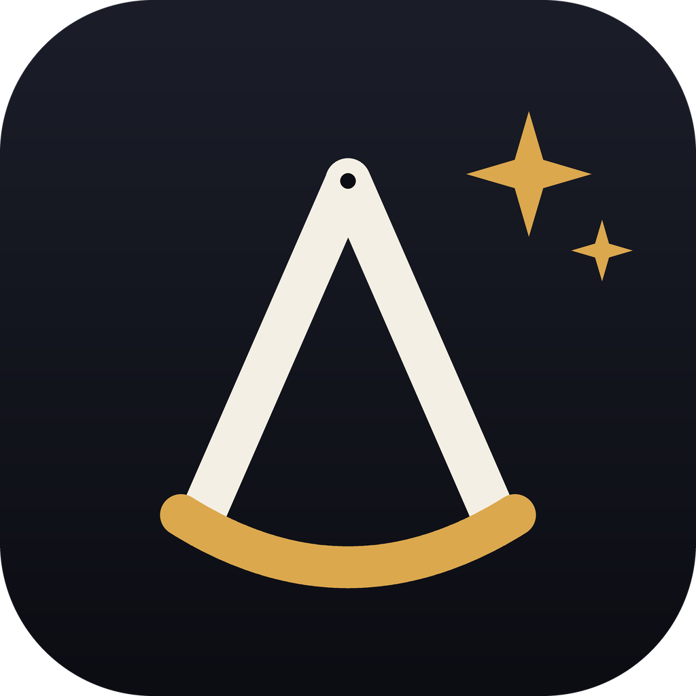
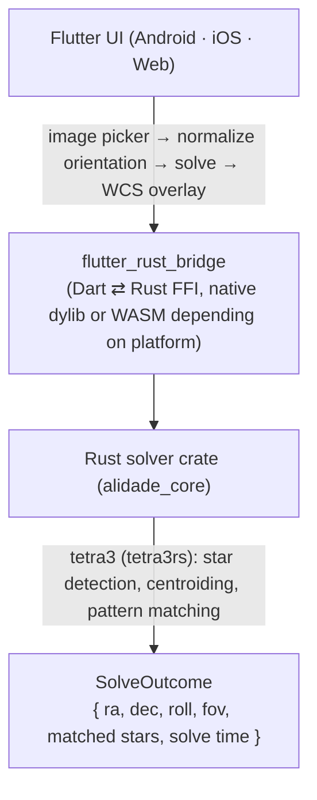

<p align="center">
  
</p>

<h1 align="center">Alidade</h1>

<p align="center">A lightweight plate solver for astrophotographers without a finder scope.</p>

<p align="center">
  <a href="https://github.com/jackyko1991/Alidade/actions/workflows/deploy-pwa.yml"></a>
  <a href="LICENSE"></a>
</p>

Point your camera, take a shot, and Alidade tells you exactly where in the sky
you're pointed — no internet connection required. Solving runs entirely
on-device (or on-page, for the web build) in well under a second.

## Try it now

| Platform | Link | Notes |
|---|---|---|
| Web (PWA) | **[jackyko1991.github.io/Alidade](https://jackyko1991.github.io/Alidade/)** | Add to your phone's home screen for an app-like install. |
| Android (APK) | **[Latest build](https://github.com/jackyko1991/Alidade/releases/tag/app-latest)** | Isn't Play Store-signed, so you'll need to allow installs from unknown sources. Built automatically from `master` on every push ([`.github/workflows/build-apk.yml`](.github/workflows/build-apk.yml)). |

The web build runs the real Rust solver compiled to WebAssembly, entirely
in your browser — nothing is uploaded anywhere. Two differences from the
native app, both because there's no browser API for persistent app storage
the way there is on Android (see [`docs/web-build.md`](docs/web-build.md)):
the downloaded solver database isn't cached to disk, so it re-downloads
once per page load, and solve history isn't saved between sessions either.

## Features

- **Fully offline lost-in-space plate solving.** Import a photo from your
  gallery and get RA/Dec, field of view, and roll in well under a second,
  with no network round-trip and nothing ever leaving your device.
- **Per-lens FOV database downloads.** Add your camera + lens (or a direct
  FOV), and Alidade fetches just the solver database sized for that field of
  view — from a 132MB database for 350-600mm telephoto down to ~100KB for
  wide 10-24mm lenses — instead of bundling every size up front. Unused
  databases are cleaned up automatically once no lens profile needs them.
- **Matched-star and named-star overlays.** See exactly which stars the
  solver detected, plus labels for bright named stars or denser Flamsteed/
  Bayer catalog designations (your choice), projected through the solved
  WCS onto the image.
- **Constellation lines**, projected the same way.
- **Reverse-lookup auto-naming** — after a successful solve, Alidade
  suggests a name for what you're looking at (Messier catalog).
- **Solve history**, with a thumbnail (matched stars baked in), full
  result, and multi-select delete.
- **Night mode** — a red-on-black theme that preserves night-adapted
  vision, the classic astronomer's red-flashlight trick.

## How it works

Alidade's solving core is [tetra3rs](https://github.com/ssmichael1/tetra3rs),
a Rust implementation of the Tetra3 lost-in-space star identification
algorithm. Given a set of star positions extracted from your photo, it
matches their geometric pattern against a bundled star catalog — no prior
pointing estimate required.



On Android/iOS the Rust core compiles to a native library (via
[cargokit](https://github.com/irondash/cargokit), no manual `cargo-ndk` step
needed) and solves off the UI thread. On the web, the same Rust source
compiles to WebAssembly (`wasm-pack`) and runs on the main thread instead —
see [`docs/web-build.md`](docs/web-build.md) for why the two builds need
separate generated bindings, if you're touching that code.

## Building

Requires Flutter (stable channel) and Rust (via rustup) installed and on
your `PATH`.

### Android / iOS / desktop

```sh
cd app
flutter pub get
flutter run --release
```

### Web (PWA)

Building the WebAssembly solver additionally needs a Rust nightly toolchain
with `rust-src`, the `wasm32-unknown-unknown` target, and `wasm-pack`:

```sh
rustup toolchain install nightly
rustup component add rust-src --toolchain nightly
rustup target add wasm32-unknown-unknown
cargo install wasm-pack

cd app
flutter config --enable-web
flutter pub get
flutter_rust_bridge_codegen generate --config-file flutter_rust_bridge_web.yaml
flutter_rust_bridge_codegen build-web --release --wasm-pack-rustflags="-C target-feature=+bulk-memory"
flutter build web --release --base-href /Alidade/
```

This is exactly what [`.github/workflows/deploy-pwa.yml`](.github/workflows/deploy-pwa.yml)
runs on every push to `master`, publishing to GitHub Pages. See
[`docs/web-build.md`](docs/web-build.md) for what each of those steps is
actually for, and why the last two steps regenerate different Dart/Rust
glue than a native build uses.

### Tests

```sh
cd app
flutter test                       # Dart unit/widget tests
cd rust && cargo test --release    # Rust solver tests against real reference images
```

There's also an end-to-end test in [`e2e/`](e2e/) (Playwright) that drives
the deployed web build in a real browser — page load, adding a lens, and a
same-origin database download — and runs automatically after every deploy.
This is what caught the CORS and `path_provider`-on-web issues documented in
[`docs/web-build.md`](docs/web-build.md); source alone didn't:

```sh
cd e2e
npm install
npx playwright install --with-deps chromium
npx playwright test                                       # against the live site
ALIDADE_URL=http://localhost:8000/Alidade/ npx playwright test  # against a local build
```

## License

Alidade's own source code is licensed under the [MIT License](LICENSE).

Bundled data carries its own license, credited in-app on the About screen
and summarized here:

| Data | Source | License |
|---|---|---|
| Solving engine | [tetra3rs](https://github.com/ssmichael1/tetra3rs) (Rust port of ESA's [tetra3](https://github.com/esa/tetra3)) | MIT / Apache-2.0 |
| Star catalog | Gaia DR3 + Hipparcos (ESA) | — |
| Named-star lookup | [IAU Catalog of Star Names](https://github.com/cyschneck/iau-star-names) | MIT |
| Star designations | Yale Bright Star Catalog (BSC5, Hoffleit & Warren 1991) | Public domain |
| Messier object lookup | [messier-registry](https://github.com/wdelenclos/messier-registry) | MIT |
| Constellation lines | [d3-celestial](https://github.com/ofrohn/d3-celestial) by Olaf Frohn | BSD-3-Clause |
